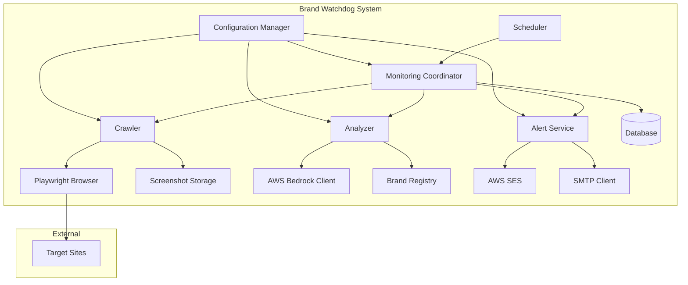
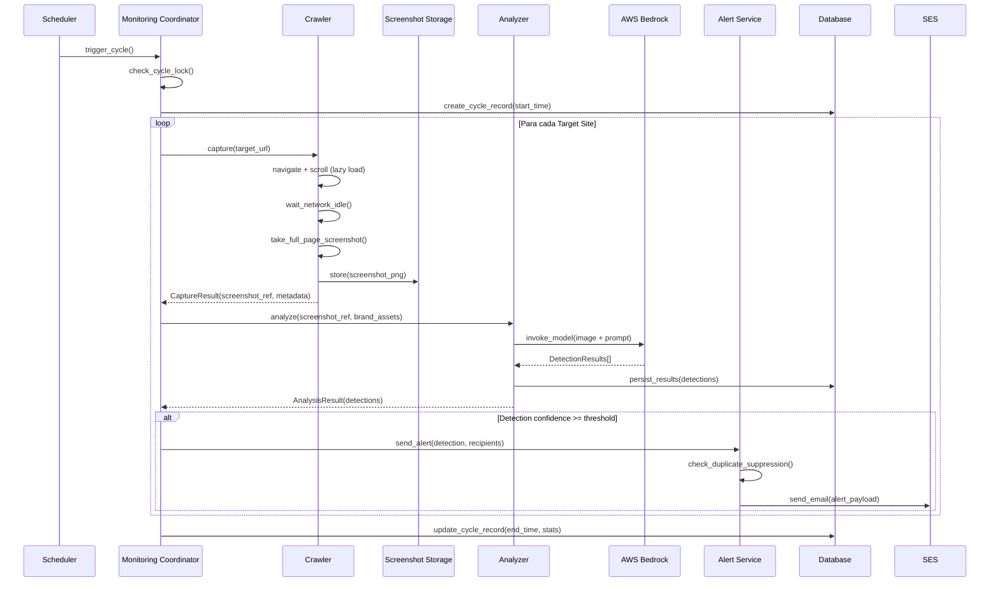
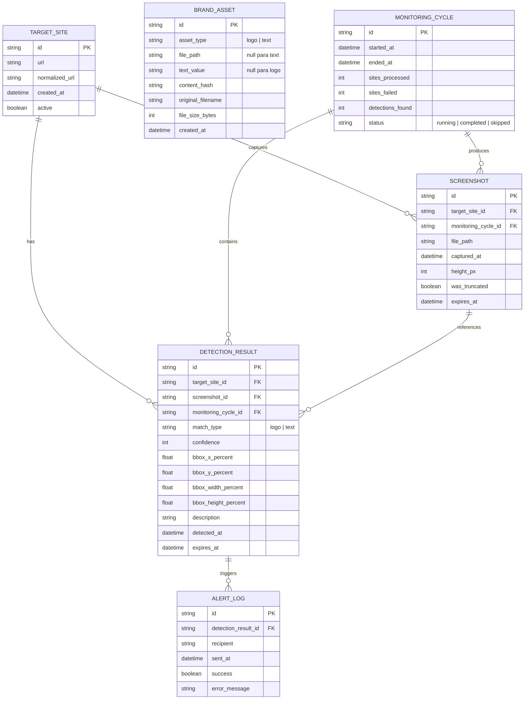

# Design Document: Brand Watchdog

## Overview

Brand Watchdog é um sistema de monitoramento automatizado que detecta uso não autorizado de ativos de marca (logotipos e menções textuais) em websites externos. O sistema opera em ciclos de monitoramento agendados, onde cada ciclo:

1. **Captura** — navega nos sites-alvo registrados e gera screenshots full-page usando Playwright
2. **Analisa** — envia os screenshots junto com ativos de marca registrados para análise multimodal via AWS Bedrock (Claude)
3. **Alerta** — notifica os proprietários da marca via email (AWS SES ou SMTP) quando uso não autorizado é detectado
4. **Persiste** — armazena resultados de detecção e screenshots para consulta histórica

### Decisões de Design

| Decisão | Escolha | Justificativa |
|---------|---------|---------------|
| Runtime | Python 3.10+ async | Permite concorrência eficiente no crawling e chamadas de API |
| Crawling | Playwright (async) | Suporte nativo a full-page screenshot com `full_page=True`, headless browser |
| AI Analysis | AWS Bedrock (Claude 3.5 Sonnet) | Modelo multimodal com excelente capacidade de análise visual |
| Email | AWS SES + SMTP fallback | SES para produção em escala, SMTP como alternativa configurável |
| Storage | SQLite (dev) / PostgreSQL (prod) | ORM via SQLAlchemy para flexibilidade de backend |
| File Storage | Filesystem local / S3 | Screenshots armazenados como PNG, configurável via abstração |
| Scheduling | APScheduler | Biblioteca Python madura para agendamento com suporte a intervalos |
| Retry | Tenacity | Decorators para retry com exponential backoff, padrão consolidado |

## Architecture

### Diagrama de Componentes



### Fluxo de Monitoramento



## Components and Interfaces

### 1. Configuration Manager (`config.py`)

Gerencia toda a configuração do sistema via arquivo YAML e variáveis de ambiente.

```python
from dataclasses import dataclass, field
from pathlib import Path

@dataclass
class CrawlerConfig:
    viewport_width: int = 1280
    page_timeout_seconds: int = 60
    network_idle_timeout_ms: int = 500
    max_screenshot_height_px: int = 20000
    screenshot_format: str = "png"

@dataclass
class AnalyzerConfig:
    bedrock_model_id: str = "anthropic.claude-3-5-sonnet-20241022-v2:0"
    bedrock_region: str = "us-east-1"
    confidence_threshold: int = 70
    request_timeout_seconds: int = 60
    max_retries: int = 3
    retry_base_delay_seconds: float = 2.0

@dataclass
class AlertConfig:
    provider: str = "ses"  # "ses" ou "smtp"
    ses_region: str = "us-east-1"
    ses_sender: str = ""
    smtp_host: str = ""
    smtp_port: int = 587
    smtp_username: str = ""
    smtp_password: str = ""
    recipients: list[str] = field(default_factory=list)
    retry_attempts: int = 3
    retry_interval_seconds: int = 30

@dataclass
class ScheduleConfig:
    interval_hours: int = 24  # 1 a 720

@dataclass
class StorageConfig:
    screenshot_retention_days: int = 90
    detection_retention_days: int = 90
    screenshot_base_path: Path = Path("./data/screenshots")
    database_url: str = "sqlite:///./data/brand_watchdog.db"

@dataclass
class AppConfig:
    crawler: CrawlerConfig = field(default_factory=CrawlerConfig)
    analyzer: AnalyzerConfig = field(default_factory=AnalyzerConfig)
    alert: AlertConfig = field(default_factory=AlertConfig)
    schedule: ScheduleConfig = field(default_factory=ScheduleConfig)
    storage: StorageConfig = field(default_factory=StorageConfig)
    max_target_sites: int = 200
```

### 2. Crawler (`crawler.py`)

Responsável por navegar nos sites-alvo e capturar screenshots full-page.

```python
from dataclasses import dataclass
from datetime import datetime, timezone

@dataclass
class CaptureResult:
    target_url: str
    screenshot_path: Path
    screenshot_ref_id: str
    captured_at: datetime
    page_height_px: int
    was_truncated: bool
    success: bool
    error_message: str | None = None

class Crawler:
    async def capture(self, target_url: str) -> CaptureResult:
        """Captura screenshot full-page do site alvo."""
        ...

    async def _scroll_for_lazy_content(self, page: Page) -> int:
        """Rola a página para carregar conteúdo lazy-loaded. Retorna altura total."""
        ...

    async def _wait_network_idle(self, page: Page) -> None:
        """Aguarda estado network-idle antes da captura."""
        ...

    async def _take_screenshot(self, page: Page, max_height: int) -> bytes:
        """Captura screenshot com limite de altura."""
        ...
```

### 3. Analyzer (`analyzer.py`)

Envia screenshots para AWS Bedrock e processa os resultados de detecção.

```python
@dataclass
class BoundingBox:
    x_percent: float
    y_percent: float
    width_percent: float
    height_percent: float

@dataclass
class DetectionResult:
    target_url: str
    match_type: str  # "logo" ou "text"
    confidence: int  # 0-100
    bounding_box: BoundingBox
    description: str
    detected_at: datetime
    screenshot_ref_id: str

class Analyzer:
    async def analyze(
        self, 
        screenshot_path: Path, 
        brand_assets: list[BrandAsset]
    ) -> list[DetectionResult]:
        """Analisa screenshot contra ativos de marca via Bedrock."""
        ...

    async def _invoke_bedrock(
        self, 
        image_bytes: bytes, 
        prompt: str
    ) -> dict:
        """Invoca modelo Bedrock com retry e exponential backoff."""
        ...

    def _build_analysis_prompt(
        self, 
        brand_assets: list[BrandAsset]
    ) -> str:
        """Constrói prompt para análise multimodal."""
        ...

    def _parse_detection_response(
        self, 
        response: dict, 
        target_url: str, 
        screenshot_ref_id: str
    ) -> list[DetectionResult]:
        """Converte resposta do Bedrock em DetectionResults."""
        ...
```

### 4. Alert Service (`alert_service.py`)

Gerencia envio de notificações por email com supressão de duplicatas.

```python
class AlertService:
    async def send_alert(
        self, 
        detection: DetectionResult, 
        recipients: list[str]
    ) -> bool:
        """Envia alerta individual para cada destinatário."""
        ...

    async def _should_suppress(self, detection: DetectionResult) -> bool:
        """Verifica se o alerta deve ser suprimido (duplicata consecutiva)."""
        ...

    async def _send_via_ses(
        self, 
        recipient: str, 
        subject: str, 
        body: str
    ) -> None:
        """Envia email via AWS SES."""
        ...

    async def _send_via_smtp(
        self, 
        recipient: str, 
        subject: str, 
        body: str
    ) -> None:
        """Envia email via SMTP."""
        ...

    def _format_alert_email(self, detection: DetectionResult) -> tuple[str, str]:
        """Formata subject e body do email de alerta."""
        ...
```

### 5. Monitoring Coordinator (`coordinator.py`)

Orquestra o ciclo completo de monitoramento.

```python
class MonitoringCoordinator:
    async def run_cycle(self) -> CycleResult:
        """Executa um ciclo completo de monitoramento."""
        ...

    async def _process_site(self, target_site: TargetSite) -> SiteResult:
        """Processa um site individual: capture → analyze → alert."""
        ...

    def _is_cycle_running(self) -> bool:
        """Verifica se um ciclo está em execução (lock)."""
        ...
```

### 6. Brand Registry (`brand_registry.py`)

Gerencia registro e consulta de ativos de marca.

```python
class BrandRegistry:
    async def register_logo(
        self, 
        image_data: bytes, 
        filename: str
    ) -> BrandAsset:
        """Registra imagem de logotipo como ativo de marca."""
        ...

    async def register_text(self, text: str) -> BrandAsset:
        """Registra texto como ativo de marca."""
        ...

    async def get_all_assets(self) -> list[BrandAsset]:
        """Retorna todos os ativos registrados."""
        ...

    async def remove_asset(self, asset_id: str) -> bool:
        """Remove um ativo de marca."""
        ...
```

### 7. Target Site Manager (`target_site_manager.py`)

Gerencia CRUD de sites-alvo com validação.

```python
class TargetSiteManager:
    def validate_url(self, url: str) -> ValidationResult:
        """Valida URL do site-alvo conforme regras de negócio."""
        ...

    def normalize_url(self, url: str) -> str:
        """Normaliza URL: lowercase scheme/host, remove trailing slash."""
        ...

    async def register(self, url: str) -> TargetSite:
        """Registra novo site-alvo após validação."""
        ...

    async def remove(self, site_id: str) -> bool:
        """Remove site-alvo da lista de monitoramento."""
        ...

    async def list_all(self) -> list[TargetSite]:
        """Lista todos os sites-alvo registrados."""
        ...
```

### 8. Detection Result Store (`detection_store.py`)

Persiste e consulta resultados de detecção.

```python
class DetectionStore:
    async def save(self, detection: DetectionResult) -> str:
        """Persiste resultado de detecção com retry."""
        ...

    async def query(
        self,
        target_url: str | None = None,
        start_date: datetime | None = None,
        end_date: datetime | None = None,
        match_type: str | None = None,
        page: int = 1,
        page_size: int = 100
    ) -> QueryResult:
        """Consulta resultados com filtros e paginação."""
        ...

    async def cleanup_expired(self) -> int:
        """Remove resultados expirados conforme retention period."""
        ...

    async def get_previous_cycle_detections(
        self, 
        target_url: str
    ) -> list[DetectionResult]:
        """Retorna detecções do ciclo anterior para supressão de duplicatas."""
        ...
```

## Data Models

### Entidades de Banco de Dados



### Modelos Python (SQLAlchemy)

```python
from sqlalchemy import Column, String, Integer, Float, Boolean, DateTime, ForeignKey
from sqlalchemy.orm import declarative_base, relationship
from datetime import datetime, timezone
import uuid

Base = declarative_base()

class TargetSiteModel(Base):
    __tablename__ = "target_sites"
    
    id: str = Column(String, primary_key=True, default=lambda: str(uuid.uuid4()))
    url: str = Column(String(2048), nullable=False)
    normalized_url: str = Column(String(2048), nullable=False, unique=True)
    created_at: datetime = Column(DateTime, default=lambda: datetime.now(timezone.utc))
    active: bool = Column(Boolean, default=True)

class BrandAssetModel(Base):
    __tablename__ = "brand_assets"
    
    id: str = Column(String, primary_key=True, default=lambda: str(uuid.uuid4()))
    asset_type: str = Column(String(10), nullable=False)  # "logo" | "text"
    file_path: str | None = Column(String(512), nullable=True)
    text_value: str | None = Column(String(256), nullable=True)
    content_hash: str = Column(String(64), nullable=False, unique=True)
    original_filename: str | None = Column(String(256), nullable=True)
    file_size_bytes: int | None = Column(Integer, nullable=True)
    created_at: datetime = Column(DateTime, default=lambda: datetime.now(timezone.utc))

class MonitoringCycleModel(Base):
    __tablename__ = "monitoring_cycles"
    
    id: str = Column(String, primary_key=True, default=lambda: str(uuid.uuid4()))
    started_at: datetime = Column(DateTime, nullable=False)
    ended_at: datetime | None = Column(DateTime, nullable=True)
    sites_processed: int = Column(Integer, default=0)
    sites_failed: int = Column(Integer, default=0)
    detections_found: int = Column(Integer, default=0)
    status: str = Column(String(20), default="running")

class ScreenshotModel(Base):
    __tablename__ = "screenshots"
    
    id: str = Column(String, primary_key=True, default=lambda: str(uuid.uuid4()))
    target_site_id: str = Column(String, ForeignKey("target_sites.id"), nullable=False)
    monitoring_cycle_id: str = Column(String, ForeignKey("monitoring_cycles.id"), nullable=False)
    file_path: str = Column(String(512), nullable=False)
    captured_at: datetime = Column(DateTime, nullable=False)
    height_px: int = Column(Integer, nullable=False)
    was_truncated: bool = Column(Boolean, default=False)
    expires_at: datetime = Column(DateTime, nullable=False)

class DetectionResultModel(Base):
    __tablename__ = "detection_results"
    
    id: str = Column(String, primary_key=True, default=lambda: str(uuid.uuid4()))
    target_site_id: str = Column(String, ForeignKey("target_sites.id"), nullable=False)
    screenshot_id: str = Column(String, ForeignKey("screenshots.id"), nullable=False)
    monitoring_cycle_id: str = Column(String, ForeignKey("monitoring_cycles.id"), nullable=False)
    match_type: str = Column(String(10), nullable=False)
    confidence: int = Column(Integer, nullable=False)
    bbox_x_percent: float = Column(Float, nullable=False)
    bbox_y_percent: float = Column(Float, nullable=False)
    bbox_width_percent: float = Column(Float, nullable=False)
    bbox_height_percent: float = Column(Float, nullable=False)
    description: str = Column(String(1024), nullable=False)
    detected_at: datetime = Column(DateTime, nullable=False)
    expires_at: datetime = Column(DateTime, nullable=False)

class AlertLogModel(Base):
    __tablename__ = "alert_logs"
    
    id: str = Column(String, primary_key=True, default=lambda: str(uuid.uuid4()))
    detection_result_id: str = Column(String, ForeignKey("detection_results.id"), nullable=False)
    recipient: str = Column(String(256), nullable=False)
    sent_at: datetime = Column(DateTime, nullable=False)
    success: bool = Column(Boolean, nullable=False)
    error_message: str | None = Column(String(1024), nullable=True)
```

### Estrutura de Diretórios do Projeto

```
brand_watchdog/
├── __init__.py
├── main.py                    # Entry point, inicialização do scheduler
├── config.py                  # Configuration Manager
├── models/
│   ├── __init__.py
│   ├── database.py            # SQLAlchemy engine e session
│   ├── entities.py            # Modelos SQLAlchemy (acima)
│   └── dataclasses.py         # Dataclasses de domínio (DTOs)
├── crawler/
│   ├── __init__.py
│   └── crawler.py             # Crawler com Playwright
├── analyzer/
│   ├── __init__.py
│   ├── analyzer.py            # Analyzer principal
│   └── bedrock_client.py      # Client AWS Bedrock
├── alerts/
│   ├── __init__.py
│   ├── alert_service.py       # Alert Service
│   └── email_providers.py     # SES e SMTP providers
├── registry/
│   ├── __init__.py
│   ├── brand_registry.py      # Brand Registry
│   └── target_site_manager.py # Target Site Manager
├── storage/
│   ├── __init__.py
│   ├── screenshot_store.py    # Screenshot storage
│   └── detection_store.py     # Detection result store
├── coordinator/
│   ├── __init__.py
│   └── coordinator.py         # Monitoring Coordinator
├── scheduler/
│   ├── __init__.py
│   └── scheduler.py           # APScheduler wrapper
└── utils/
    ├── __init__.py
    ├── retry.py               # Retry helpers com Tenacity
    ├── validators.py          # URL e asset validators
    └── hashing.py             # Content hashing utilities
```


## Low-Level Design

### Algoritmo: Scroll para Lazy Loading

```python
async def _scroll_for_lazy_content(self, page: Page) -> int:
    """
    Rola a página inteira para forçar carregamento de conteúdo lazy-loaded.
    Retorna a altura total da página em pixels.
    
    Algoritmo:
    1. Obtém altura total inicial do body
    2. Rola incrementalmente (viewport height por vez)
    3. Após cada scroll, aguarda estabilização da rede
    4. Repete até atingir o final ou limite de 20,000px
    5. Rola de volta ao topo para screenshot consistente
    """
    viewport_height = self._config.viewport_width  # proporção 1:1 para scroll step
    max_height = self._config.max_screenshot_height_px
    previous_height = 0
    
    while True:
        current_height = await page.evaluate("document.body.scrollHeight")
        
        if current_height == previous_height:
            break  # Sem novo conteúdo carregado
            
        if current_height >= max_height:
            logger.warning(
                "Página excede limite de %d px, será truncada", max_height
            )
            break
        
        # Rola para a próxima seção
        await page.evaluate(f"window.scrollBy(0, {viewport_height})")
        
        # Aguarda carregamento de novos elementos
        await page.wait_for_load_state("networkidle")
        await asyncio.sleep(0.3)  # Buffer para rendering
        
        previous_height = current_height
    
    # Volta ao topo para screenshot completo
    await page.evaluate("window.scrollTo(0, 0)")
    await asyncio.sleep(0.2)
    
    final_height = await page.evaluate("document.body.scrollHeight")
    return min(final_height, max_height)
```

### Algoritmo: Construção de Prompt para Bedrock

```python
def _build_analysis_prompt(self, brand_assets: list[BrandAsset]) -> str:
    """
    Constrói prompt estruturado para análise multimodal.
    
    O prompt instrui o modelo a:
    1. Analisar a imagem procurando logos/textos específicos
    2. Retornar resultados em JSON estruturado
    3. Incluir bounding boxes como percentuais
    """
    logo_descriptions = []
    text_identifiers = []
    
    for asset in brand_assets:
        if asset.asset_type == "logo":
            logo_descriptions.append(asset.original_filename or "logo sem nome")
        else:
            text_identifiers.append(asset.text_value)
    
    prompt = f"""Analise esta screenshot de website procurando por uso de marca.

LOGOS para detectar: {', '.join(logo_descriptions)}
TEXTOS para detectar: {', '.join(text_identifiers)}

Instruções:
- Identifique qualquer ocorrência dos logos listados, mesmo que redimensionados, 
  recoloridos, rotacionados ou distorcidos.
- Identifique qualquer ocorrência dos textos listados, independente de fonte ou tamanho.
- Para cada detecção, forneça bounding box como percentual das dimensões da imagem.

Retorne um JSON com a seguinte estrutura:
{{
  "detections": [
    {{
      "match_type": "logo" | "text",
      "confidence": <0-100>,
      "bounding_box": {{
        "x_percent": <float>,
        "y_percent": <float>,
        "width_percent": <float>,
        "height_percent": <float>
      }},
      "description": "<descrição do que foi encontrado e contexto>"
    }}
  ]
}}

Se nenhuma marca for detectada, retorne: {{"detections": []}}
"""
    return prompt
```

### Algoritmo: Invocação do Bedrock com Retry

```python
from tenacity import retry, stop_after_attempt, wait_exponential, retry_if_exception_type
import boto3
import json
import base64

class BedrockClient:
    def __init__(self, config: AnalyzerConfig):
        self._config = config
        self._client = boto3.client(
            "bedrock-runtime", region_name=config.bedrock_region
        )

    @retry(
        stop=stop_after_attempt(3),
        wait=wait_exponential(multiplier=2, min=2, max=8),
        retry=retry_if_exception_type((BotoCoreError, ClientError, TimeoutError)),
    )
    async def invoke_model(
        self, image_bytes: bytes, prompt: str
    ) -> dict:
        """
        Invoca Claude via Bedrock com imagem e prompt.
        Retry automático com backoff exponencial: 2s, 4s, 8s.
        """
        image_base64 = base64.b64encode(image_bytes).decode("utf-8")
        
        request_body = {
            "anthropic_version": "bedrock-2023-05-31",
            "max_tokens": 4096,
            "messages": [
                {
                    "role": "user",
                    "content": [
                        {
                            "type": "image",
                            "source": {
                                "type": "base64",
                                "media_type": "image/png",
                                "data": image_base64,
                            },
                        },
                        {"type": "text", "text": prompt},
                    ],
                }
            ],
        }
        
        response = self._client.invoke_model(
            modelId=self._config.bedrock_model_id,
            body=json.dumps(request_body),
            contentType="application/json",
            accept="application/json",
        )
        
        response_body = json.loads(response["body"].read())
        return self._extract_json_from_response(response_body)
```

### Algoritmo: URL Validation e Normalization

```python
from urllib.parse import urlparse, urlunparse
import re

class URLValidator:
    """Valida e normaliza URLs de Target Sites."""
    
    MAX_URL_LENGTH = 2048
    VALID_SCHEMES = {"http", "https"}
    
    # Regex para hostname válido (RFC 1123)
    HOSTNAME_PATTERN = re.compile(
        r"^[a-zA-Z0-9]([a-zA-Z0-9\-]{0,61}[a-zA-Z0-9])?"
        r"(\.[a-zA-Z0-9]([a-zA-Z0-9\-]{0,61}[a-zA-Z0-9])?)*$"
    )

    def validate(self, url: str) -> ValidationResult:
        """
        Valida URL conforme regras:
        - Deve conter scheme http ou https
        - Deve ter hostname sintaticamente válido
        - Comprimento máximo de 2048 caracteres
        """
        if len(url) > self.MAX_URL_LENGTH:
            return ValidationResult(
                valid=False, 
                error=f"URL excede comprimento máximo de {self.MAX_URL_LENGTH} caracteres"
            )
        
        parsed = urlparse(url)
        
        if parsed.scheme.lower() not in self.VALID_SCHEMES:
            return ValidationResult(
                valid=False, 
                error="URL deve conter scheme http ou https"
            )
        
        hostname = parsed.hostname
        if not hostname or not self.HOSTNAME_PATTERN.match(hostname):
            return ValidationResult(
                valid=False, 
                error="URL deve conter hostname sintaticamente válido"
            )
        
        return ValidationResult(valid=True, error=None)

    def normalize(self, url: str) -> str:
        """
        Normaliza URL:
        - Scheme em lowercase
        - Hostname em lowercase
        - Remove trailing slash do path
        """
        parsed = urlparse(url)
        normalized = parsed._replace(
            scheme=parsed.scheme.lower(),
            netloc=parsed.netloc.lower(),
            path=parsed.path.rstrip("/") if parsed.path != "/" else "",
        )
        result = urlunparse(normalized)
        return result.rstrip("/")
```

### Algoritmo: Supressão de Alertas Duplicados

```python
async def _should_suppress(self, detection: DetectionResult) -> bool:
    """
    Verifica se a detecção é duplicata do ciclo anterior.
    
    Duplicata = mesmo Target_Site + mesmo match_type + mesmo bounding_box
    (com tolerância de 5% nas coordenadas do bounding_box).
    
    Returns:
        True se o alerta deve ser suprimido (duplicata consecutiva)
    """
    previous_detections = await self._detection_store.get_previous_cycle_detections(
        target_url=detection.target_url
    )
    
    for prev in previous_detections:
        if (
            prev.match_type == detection.match_type
            and self._bounding_boxes_overlap(prev.bounding_box, detection.bounding_box)
        ):
            return True
    
    return False

def _bounding_boxes_overlap(self, box1: BoundingBox, box2: BoundingBox) -> bool:
    """Verifica se dois bounding boxes são suficientemente similares (tolerância 5%)."""
    tolerance = 5.0  # percentual
    return (
        abs(box1.x_percent - box2.x_percent) <= tolerance
        and abs(box1.y_percent - box2.y_percent) <= tolerance
        and abs(box1.width_percent - box2.width_percent) <= tolerance
        and abs(box1.height_percent - box2.height_percent) <= tolerance
    )
```

### Algoritmo: Cleanup de Itens Expirados

```python
from datetime import datetime, timezone

async def cleanup_expired(self) -> int:
    """
    Remove detecções e screenshots expirados.
    
    Retorna o número total de itens removidos.
    Executa em batch para não sobrecarregar o banco.
    """
    now = datetime.now(timezone.utc)
    total_removed = 0
    batch_size = 100
    
    # Remove detection results expirados
    while True:
        expired_detections = await self._db.query(
            DetectionResultModel
        ).filter(
            DetectionResultModel.expires_at <= now
        ).limit(batch_size).all()
        
        if not expired_detections:
            break
        
        for detection in expired_detections:
            await self._db.delete(detection)
            total_removed += 1
        
        await self._db.commit()
    
    # Remove screenshots expirados (e arquivos físicos)
    while True:
        expired_screenshots = await self._db.query(
            ScreenshotModel
        ).filter(
            ScreenshotModel.expires_at <= now
        ).limit(batch_size).all()
        
        if not expired_screenshots:
            break
        
        for screenshot in expired_screenshots:
            # Remove arquivo físico
            file_path = Path(screenshot.file_path)
            if file_path.exists():
                file_path.unlink()
            await self._db.delete(screenshot)
            total_removed += 1
        
        await self._db.commit()
    
    logger.info("Cleanup concluído: %d itens removidos", total_removed)
    return total_removed
```

## Correctness Properties

*A property is a characteristic or behavior that should hold true across all valid executions of a system — essentially, a formal statement about what the system should do. Properties serve as the bridge between human-readable specifications and machine-verifiable correctness guarantees.*

### Property 1: URL Validation Correctness

*For any* string, the URL validator SHALL accept it if and only if it contains an http or https scheme, a syntactically valid hostname (matching RFC 1123), an optional path, and total length ≤ 2048 characters. All other strings SHALL be rejected with an appropriate error message.

**Validates: Requirements 1.1, 1.3, 1.5**

### Property 2: URL Normalization Idempotence

*For any* valid URL, normalizing it (lowercasing scheme and hostname, removing trailing slashes) and then normalizing the result again SHALL produce the same string. Additionally, for any two URLs that differ only in scheme/hostname casing or trailing slashes, normalization SHALL produce identical output.

**Validates: Requirements 1.4**

### Property 3: Brand Asset Registration Round-Trip

*For any* valid brand asset (logo with valid format/size or text with 2-256 visible characters), after registering it in the Brand Registry and then querying all assets, the result set SHALL contain an asset with identical content.

**Validates: Requirements 2.3**

### Property 4: Brand Asset Deduplication

*For any* brand asset that has been successfully registered, attempting to register an asset with identical content (same file bytes for logos, same string for text) SHALL be rejected with a duplicate error.

**Validates: Requirements 2.5**

### Property 5: Brand Text Validation

*For any* string between 2 and 256 characters containing at least 2 visible (non-whitespace) characters, the brand text validator SHALL accept it. *For any* string that is empty, has fewer than 2 characters, exceeds 256 characters, or contains only whitespace characters, the validator SHALL reject it.

**Validates: Requirements 2.2, 2.6**

### Property 6: Image Format Validation

*For any* file upload, the brand asset image validator SHALL accept it if and only if its format is PNG, JPG, or SVG and its size is ≤ 5 MB. Files with any other format SHALL be rejected regardless of size.

**Validates: Requirements 2.1, 2.4**

### Property 7: Screenshot Height Truncation

*For any* page with rendered height exceeding 20,000 pixels, the Crawler SHALL produce a screenshot with height ≤ 20,000 pixels and mark it as truncated. For pages with height ≤ 20,000 pixels, the screenshot SHALL capture the full height without truncation marking.

**Validates: Requirements 3.6**

### Property 8: Bedrock Response Parsing

*For any* valid Bedrock JSON response containing a "detections" array, the parser SHALL extract each detection with correct match_type (string "logo" or "text"), confidence (integer 0-100), and bounding_box (four float percentages x, y, width, height each in [0, 100]).

**Validates: Requirements 4.4**

### Property 9: Confidence Threshold Classification

*For any* DetectionResult with confidence ≥ the configured threshold (default 60), the Analyzer SHALL classify it as a confirmed match. *For any* DetectionResult with confidence below the threshold, it SHALL NOT be classified as confirmed.

**Validates: Requirements 4.5**

### Property 10: Schedule Frequency Validation

*For any* integer value, the schedule frequency validator SHALL accept it if and only if it is between 1 and 720 (inclusive). Values outside this range SHALL be rejected.

**Validates: Requirements 5.2**

### Property 11: Cycle Processes All Sites

*For any* non-empty set of active Target Sites, a monitoring cycle SHALL attempt to process each one, resulting in either a success or failure record for every site in the set.

**Validates: Requirements 5.3**

### Property 12: Cycle Result Completeness

*For any* completed monitoring cycle, the result record SHALL contain: start_time, end_time (both non-null), sites_processed count ≥ 0, sites_failed count ≥ 0, and detections_found count ≥ 0, where sites_processed + sites_failed equals the total number of active Target Sites.

**Validates: Requirements 5.6**

### Property 13: Alert Email Content Completeness

*For any* DetectionResult that triggers an alert, the formatted email SHALL contain: the Target_Site URL, the match type ("logo" or "text"), the confidence level (0-100), a description of the match location, and the detection timestamp in ISO 8601 format.

**Validates: Requirements 6.2**

### Property 14: Duplicate Alert Suppression

*For any* DetectionResult that matches a detection from the immediately previous cycle (same Target_Site URL, same match_type, and overlapping bounding_box within tolerance), the Alert Service SHALL suppress the alert. *For any* DetectionResult NOT matching the previous cycle, the alert SHALL be sent.

**Validates: Requirements 6.7**

### Property 15: Detection Result Persistence Round-Trip

*For any* valid DetectionResult, after persisting it and then querying by its ID, the retrieved record SHALL contain the same target_url, detected_at timestamp, match_type, confidence, bounding_box, and screenshot_ref_id.

**Validates: Requirements 7.1**

### Property 16: Retention Period Configuration Validation

*For any* integer value, the retention period validator SHALL accept it if and only if it is between 1 and 365 (inclusive). Values outside this range SHALL be rejected. This applies to both detection results and screenshot retention.

**Validates: Requirements 7.3, 8.3**

### Property 17: Expired Item Cleanup

*For any* set of stored items (detection results or screenshots) with varying expiration dates, running cleanup at time T SHALL remove all items with expires_at ≤ T and retain all items with expires_at > T.

**Validates: Requirements 7.4, 8.4**

### Property 18: Query Filtering Correctness

*For any* set of stored DetectionResults and any combination of query filters (target_url, date range, match_type), all returned results SHALL match every applied filter, be ordered in reverse chronological order, and the result set SHALL contain at most 100 items per page.

**Validates: Requirements 7.5**

### Property 19: Screenshot Storage Round-Trip

*For any* PNG byte sequence, storing it via the Screenshot Store and then reading it back SHALL produce a byte-for-byte identical file. The stored screenshot SHALL be associated with the correct Target_Site URL and capture timestamp (UTC, second precision).

**Validates: Requirements 8.1, 8.5**

## Error Handling

### Estratégia de Retry por Componente

| Componente | Operação | Max Retries | Estratégia | Delays |
|------------|----------|-------------|------------|--------|
| Crawler | Page load | 0 | Log + skip | N/A (timeout 60s) |
| Analyzer | Bedrock invoke | 3 | Exponential backoff | 2s, 4s, 8s |
| Alert Service | Email send | 3 | Intervalo fixo | 30s, 30s, 30s |
| Detection Store | DB persist | 3 | Exponential backoff | 1s, 2s, 4s |
| Screenshot Store | File write | 3 | Exponential backoff | 1s, 2s, 4s |

### Tratamento de Erros por Cenário

```python
# Padrão de retry usando Tenacity
from tenacity import (
    retry,
    stop_after_attempt,
    wait_exponential,
    wait_fixed,
    retry_if_exception_type,
    before_sleep_log,
)

# Analyzer: Bedrock com exponential backoff
@retry(
    stop=stop_after_attempt(4),  # 1 tentativa + 3 retries
    wait=wait_exponential(multiplier=2, min=2, max=8),
    retry=retry_if_exception_type((BotoCoreError, ClientError, TimeoutError)),
    before_sleep=before_sleep_log(logger, logging.WARNING),
)
async def _invoke_bedrock(self, image_bytes: bytes, prompt: str) -> dict:
    ...

# Alert Service: intervalo fixo de 30s
@retry(
    stop=stop_after_attempt(4),
    wait=wait_fixed(30),
    retry=retry_if_exception_type((SMTPException, BotoCoreError)),
    before_sleep=before_sleep_log(logger, logging.WARNING),
)
async def _send_email(self, recipient: str, subject: str, body: str) -> None:
    ...

# Storage: exponential backoff para operações de banco/disco
@retry(
    stop=stop_after_attempt(4),
    wait=wait_exponential(multiplier=1, min=1, max=4),
    retry=retry_if_exception_type((IOError, SQLAlchemyError)),
    before_sleep=before_sleep_log(logger, logging.WARNING),
)
async def _persist_detection(self, detection: DetectionResult) -> str:
    ...
```

### Logging Estruturado

```python
import logging
import json
from datetime import datetime, timezone

logger = logging.getLogger("brand_watchdog")

# Formato de log estruturado
class StructuredFormatter(logging.Formatter):
    def format(self, record: logging.LogRecord) -> str:
        log_entry = {
            "timestamp": datetime.now(timezone.utc).isoformat(),
            "level": record.levelname,
            "component": record.name,
            "message": record.getMessage(),
        }
        if hasattr(record, "extra_data"):
            log_entry["data"] = record.extra_data
        return json.dumps(log_entry)
```

### Fallback e Graceful Degradation

1. **Crawler falha em um site** → Loga erro, marca site como failed no ciclo, prossegue para o próximo
2. **Bedrock indisponível após retries** → Marca análise como incompleta, não gera alerta, loga para revisão manual
3. **Email falha após retries** → Loga falha com destinatário e URL, detecção permanece armazenada para consulta
4. **Banco de dados indisponível** → Falha crítica, loga e notifica via stderr, ciclo é abortado
5. **Storage de screenshots falha** → Loga, análise ainda pode prosseguir se screenshot estiver em memória

## Testing Strategy

### Abordagem Dual: Unit Tests + Property-Based Tests

O Brand Watchdog utiliza uma estratégia de testes em duas camadas complementares:

1. **Property-Based Tests (Hypothesis)** — Verificam propriedades universais com inputs gerados aleatoriamente (mínimo 100 iterações por propriedade)
2. **Unit Tests (pytest)** — Cobrem exemplos específicos, edge cases e integrações mockadas

### Biblioteca de Property-Based Testing

- **Framework**: [Hypothesis](https://hypothesis.readthedocs.io/) para Python
- **Configuração**: mínimo 100 examples por teste (`@settings(max_examples=100)`)
- **Tag format**: `# Feature: brand-watchdog, Property {N}: {título}`

### Mapeamento de Propriedades para Testes

| Property | Módulo Testado | Tipo de Generator |
|----------|---------------|-------------------|
| P1: URL Validation | `validators.py` | URLs com schemes, hostnames e paths aleatórios |
| P2: URL Normalization | `validators.py` | URLs válidas com variações de case e trailing slashes |
| P3: Brand Asset Round-Trip | `brand_registry.py` | Assets válidos (logo bytes, text strings) |
| P4: Brand Deduplication | `brand_registry.py` | Pares de assets idênticos |
| P5: Brand Text Validation | `validators.py` | Strings de 0-300 chars com mix de whitespace |
| P6: Image Format Validation | `validators.py` | File headers + tamanhos variados |
| P7: Screenshot Truncation | `crawler.py` | Alturas de página 1-50000px |
| P8: Bedrock Response Parsing | `analyzer.py` | JSON responses com arrays de detecções variadas |
| P9: Confidence Threshold | `analyzer.py` | DetectionResults com confidence 0-100 |
| P10: Schedule Frequency | `config.py` | Inteiros de -100 a 1000 |
| P11: Cycle All Sites | `coordinator.py` | Conjuntos de 1-50 target sites (mockados) |
| P12: Cycle Result Stats | `coordinator.py` | Ciclos com mix de sucesso/falha |
| P13: Alert Email Content | `alert_service.py` | DetectionResults variados |
| P14: Duplicate Suppression | `alert_service.py` | Pares de detecções (current vs previous) |
| P15: Detection Round-Trip | `detection_store.py` | DetectionResults completos |
| P16: Retention Validation | `config.py` | Inteiros de -100 a 500 |
| P17: Expired Cleanup | `detection_store.py` | Itens com expiration variada |
| P18: Query Filtering | `detection_store.py` | Conjuntos de detecções + filtros |
| P19: Screenshot Round-Trip | `screenshot_store.py` | PNG bytes aleatórios |

### Unit Tests (Exemplos Específicos)

- **Crawler**: timeout handling, HTTP error codes, network errors
- **Analyzer**: Bedrock retry exhaustion, parsing de resposta malformada
- **Alert Service**: provider selection (SES vs SMTP), retry on send failure
- **Coordinator**: cycle lock mechanism, concurrent cycle skip
- **Config**: loading de YAML, variáveis de ambiente como override

### Integration Tests

- **Crawler + Playwright**: captura de página local com lazy-loaded content
- **Analyzer + Bedrock mock**: fluxo completo de análise com respostas simuladas
- **Alert + SES/SMTP mock**: envio de email com verificação de conteúdo
- **Full cycle**: ciclo completo com todos os componentes mockados externamente

### Estrutura de Testes

```
tests/
├── conftest.py                 # Fixtures compartilhadas (DB, mocks)
├── property/                   # Property-based tests (Hypothesis)
│   ├── test_url_validation.py
│   ├── test_brand_registry.py
│   ├── test_analyzer.py
│   ├── test_alert_service.py
│   ├── test_detection_store.py
│   ├── test_screenshot_store.py
│   └── test_coordinator.py
├── unit/                       # Unit tests (pytest)
│   ├── test_crawler.py
│   ├── test_analyzer.py
│   ├── test_alert_service.py
│   ├── test_coordinator.py
│   └── test_config.py
└── integration/                # Integration tests
    ├── test_crawl_flow.py
    ├── test_analysis_flow.py
    └── test_full_cycle.py
```

### Dependências de Teste

```
pytest>=7.0
pytest-asyncio>=0.21
hypothesis>=6.80
pytest-mock>=3.10
aioresponses>=0.7
```
