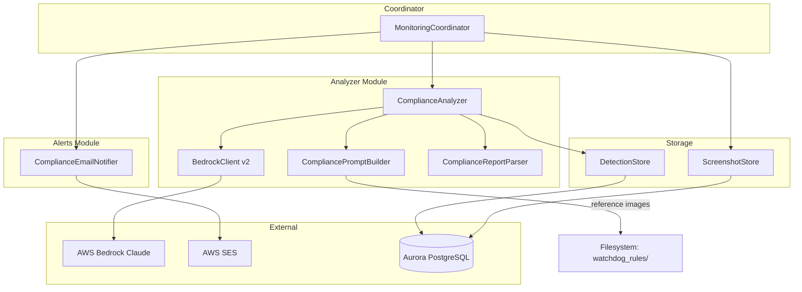
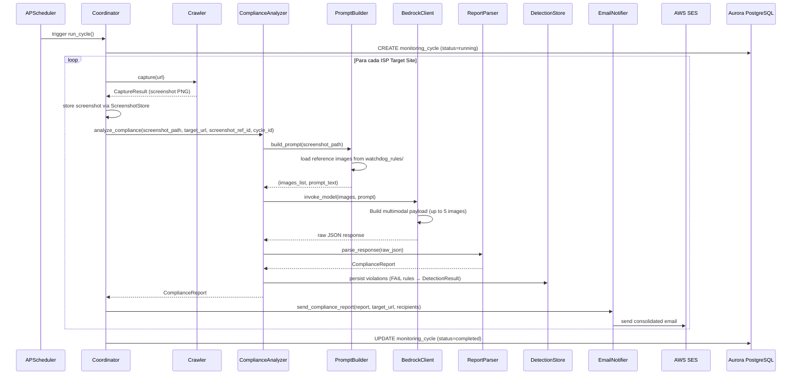

# Design Document — MVP.1 SKY+/Amazon Compliance Validation

## Overview

Este design descreve a transformação do módulo Analyzer do Brand Watchdog de "detecção de presença de marca" para um **sistema de validação de compliance da parceria SKY+/Amazon Prime**. A infraestrutura existente (ECS Fargate, Playwright, Bedrock Claude, SES, Aurora PostgreSQL) permanece inalterada — a transformação ocorre exclusivamente na camada de análise e apresentação de resultados.

### Decisões Arquiteturais Chave

1. **Substituição do Analyzer, não extensão**: O `ComplianceAnalyzer` substitui o `Analyzer` no fluxo do Coordinator. O código original permanece no repositório para referência, mas não é invocado no fluxo de compliance.
2. **Prompt multimodal com múltiplas imagens**: O Bedrock Client é estendido para enviar até 5 imagens (1 screenshot + até 4 referências) em uma única chamada.
3. **Resultados por regra**: Em vez de uma lista de detecções genéricas, o sistema retorna um `ComplianceReport` com status pass/fail por regra.
4. **Reuso do DetectionResultModel para violações**: Apenas regras com status "FAIL" geram registros em `detection_results`, permitindo reuso da lógica de expiração e alert suppression existente.
5. **Email consolidado por site**: Em vez de 1 email por detecção, o sistema envia 1 relatório consolidado por ISP por ciclo.

---

## Architecture

### Diagrama de Componentes (Pós-transformação)



### Fluxo de Dados do Ciclo de Compliance



---

## Components and Interfaces

### 1. ComplianceAnalyzer (novo)

**Localização:** `brand_watchdog/analyzer/compliance_analyzer.py`

Substitui o `Analyzer` como componente principal de análise no fluxo de compliance.

```python
@dataclass
class ComplianceRuleResult:
    """Resultado de uma regra individual de compliance."""
    rule_id: str              # ex: "facilitator_role", "logo_application"
    status: str               # "PASS", "FAIL", "NOT_APPLICABLE"
    confidence: int           # 0-100
    description: str          # max 1024 chars

@dataclass
class ComplianceReport:
    """Relatório completo de compliance para um site."""
    target_url: str
    analyzed_at: datetime
    overall_status: str       # "compliant", "non_compliant", "error"
    rule_results: list[ComplianceRuleResult]
    screenshot_ref_id: str
    cycle_id: str

class ComplianceAnalyzer:
    def __init__(
        self,
        config: AnalyzerConfig,
        bedrock_client: BedrockClient | None = None,
        prompt_builder: CompliancePromptBuilder | None = None,
    ) -> None: ...

    async def analyze_compliance(
        self,
        screenshot_path: Path,
        target_url: str,
        screenshot_ref_id: str,
        cycle_id: str,
    ) -> ComplianceReport: ...
```

### 2. CompliancePromptBuilder (novo)

**Localização:** `brand_watchdog/analyzer/compliance_prompt_builder.py`

Responsável por construir o prompt multimodal com regras de compliance + imagens de referência.

```python
@dataclass
class PromptPayload:
    """Payload pronto para envio ao BedrockClient."""
    images: list[tuple[bytes, str]]  # (image_bytes, label)
    prompt_text: str

class CompliancePromptBuilder:
    REFERENCE_IMAGES_DIR: Path = Path("watchdog_rules/SKY_Amazon_Imagens")

    REFERENCE_IMAGES: dict[str, str] = {
        "Artes_aprovadas_referencia.PNG": "approved_art_reference",
        "Logo_errado_logo_correto.PNG": "correct_logo_reference",
        "logo_sky_plus_amazon.PNG": "official_sky_plus_logo",
    }

    def __init__(self, rules_base_path: Path | None = None) -> None: ...

    def build_prompt(self, screenshot_path: Path) -> PromptPayload: ...

    def _load_reference_images(self) -> list[tuple[bytes, str]]: ...

    def _build_rules_text(self) -> str: ...
```

### 3. BedrockClient v2 (modificado)

**Localização:** `brand_watchdog/analyzer/bedrock_client.py`

O método `invoke_model` ganha uma nova assinatura para suportar múltiplas imagens. A assinatura original é mantida para backwards compatibility via overload.

```python
class BedrockClient:
    # Nova assinatura (multi-image)
    async def invoke_model_multi(
        self,
        images: list[tuple[bytes, str]],  # (image_bytes, label)
        prompt: str,
    ) -> dict[str, Any]: ...

    # Assinatura original mantida (backwards compatible)
    async def invoke_model(
        self, image_bytes: bytes, prompt: str
    ) -> dict[str, Any]: ...

    def _build_multi_image_payload(
        self,
        images: list[tuple[bytes, str]],
        prompt: str,
    ) -> dict[str, Any]: ...

    def _validate_payload_size(
        self, images: list[tuple[bytes, str]]
    ) -> list[tuple[bytes, str]]: ...
```

**Regras de payload:**
- Máximo total: 20 MB → se exceder, envia apenas o screenshot
- Máximo por imagem de referência: 5 MB → skip individual com warning
- Máximo de imagens: 5

### 4. ComplianceEmailNotifier (novo)

**Localização:** `brand_watchdog/alerts/compliance_email_notifier.py`

Envia 1 email consolidado por ISP por ciclo.

```python
class ComplianceEmailNotifier:
    def __init__(
        self,
        config: AlertConfig,
        email_provider: EmailProvider | None = None,
    ) -> None: ...

    async def send_compliance_report(
        self,
        report: ComplianceReport,
        recipients: list[str],
    ) -> bool: ...

    def _format_compliance_email(
        self, report: ComplianceReport
    ) -> tuple[str, str]: ...

    async def _send_with_retry(
        self,
        recipient: str,
        subject: str,
        body: str,
    ) -> bool: ...
```

### 5. MonitoringCoordinator (modificado)

**Localização:** `brand_watchdog/coordinator/coordinator.py`

O método `_process_site` é refatorado para usar `ComplianceAnalyzer` + `ComplianceEmailNotifier` em vez de `Analyzer` + `AlertService`.

```python
class MonitoringCoordinator:
    def __init__(
        self,
        crawler: Crawler,
        compliance_analyzer: ComplianceAnalyzer,  # substitui Analyzer
        compliance_notifier: ComplianceEmailNotifier,  # substitui AlertService
        detection_store: DetectionStore,
        screenshot_store: ScreenshotStore,
        target_site_manager: TargetSiteManager,
        config: AppConfig,
    ) -> None: ...

    async def _process_site(
        self,
        target_site: TargetSite,
        cycle_id: str,
    ) -> SiteResult: ...
```

---

## Data Models

### Novos Dataclasses (DTOs)

```python
# brand_watchdog/models/dataclasses.py (adições)

@dataclass
class ComplianceRuleResult:
    """Resultado de validação de uma regra individual de compliance."""
    rule_id: str              # "facilitator_role", "logo_application", etc.
    status: str               # "PASS", "FAIL", "NOT_APPLICABLE"
    confidence: int           # 0-100
    description: str          # Descrição dos achados (max 1024 chars)


@dataclass
class ComplianceReport:
    """Relatório consolidado de compliance para um ISP."""
    target_url: str
    analyzed_at: datetime
    overall_status: str       # "compliant", "non_compliant", "error"
    rule_results: list[ComplianceRuleResult]
    screenshot_ref_id: str
    cycle_id: str
```

### Reuso do DetectionResultModel para Violações

Para cada `ComplianceRuleResult` com status "FAIL", um `DetectionResultModel` é criado:

| Campo DetectionResultModel | Valor para Compliance |
|---|---|
| `match_type` | `rule_id` (ex: "facilitator_role") |
| `confidence` | `confidence` da regra (0-100) |
| `bbox_x_percent` | `0.0` |
| `bbox_y_percent` | `0.0` |
| `bbox_width_percent` | `0.0` |
| `bbox_height_percent` | `0.0` |
| `description` | `description` da regra (max 1024) |
| `detected_at` | `analyzed_at` do report |
| `expires_at` | `analyzed_at + detection_retention_days` |

Isso permite que a lógica existente de cleanup (expiração por `expires_at`) e indexes funcionem sem modificação no schema do banco.

### Regras de Compliance Configuradas

```python
COMPLIANCE_RULES: list[str] = [
    "facilitator_role",
    "logo_application",
    "logo_effects",
    "content_separation",
    "naming_pricing",
    "kv_integrity",
]
```

### Formato de Resposta Esperado do Bedrock

```json
{
  "compliance_results": [
    {
      "rule_id": "facilitator_role",
      "status": "PASS",
      "confidence": 92,
      "description": "Todas as menções de Amazon Prime estão associadas a referências SKY+ na mesma página."
    },
    {
      "rule_id": "logo_application",
      "status": "FAIL",
      "confidence": 87,
      "description": "Logo Amazon Music aparece antes do logo SKY+ na ordem de leitura (esquerda para direita)."
    }
  ]
}
```

---


## Correctness Properties

*A property is a characteristic or behavior that should hold true across all valid executions of a system — essentially, a formal statement about what the system should do. Properties serve as the bridge between human-readable specifications and machine-verifiable correctness guarantees.*

### Property 1: ComplianceReport serialization round-trip

*For any* valid `ComplianceReport` object (with valid rule_ids, statuses in {"PASS","FAIL","NOT_APPLICABLE"}, confidence 0-100, and description ≤ 1024 chars), serializing to dict/JSON and then deserializing back SHALL produce a field-by-field identical object (same target_url, analyzed_at, overall_status, and identical rule_results list).

**Validates: Requirements 7.5**

### Property 2: Overall compliance status derivation

*For any* list of `ComplianceRuleResult` objects, the derived `overall_status` SHALL be "non_compliant" if and only if at least one rule has status "FAIL"; otherwise it SHALL be "compliant". This holds regardless of confidence values, description content, or number of rules.

**Validates: Requirements 7.3, 7.4**

### Property 3: Malformed Bedrock response error handling

*For any* JSON string that does NOT conform to the expected compliance response schema (missing "compliance_results" key, invalid status values, missing required fields, or fewer rules than configured), the `ComplianceAnalyzer` SHALL return an error indication and SHALL NOT produce a partial `ComplianceReport` object.

**Validates: Requirements 7.6, 7.7**

### Property 4: Email formatting completeness

*For any* valid `ComplianceReport` (compliant or non_compliant), the formatted email body SHALL contain: the ISP target URL, the analysis timestamp in ISO 8601 format, the overall compliance status, and for EVERY rule in the report, the rule identifier, its pass/fail status, and its confidence score.

**Validates: Requirements 8.2, 8.3, 8.4**

### Property 5: FAIL rule mapping to DetectionResult

*For any* `ComplianceRuleResult` with status "FAIL", the system SHALL produce a `DetectionResult` where: `match_type` equals the `rule_id`, `confidence` equals the rule's confidence, all bounding box coordinates are 0.0, `description` equals the rule's description, and `expires_at` equals `analyzed_at + timedelta(days=detection_retention_days)`.

**Validates: Requirements 9.3, 9.5**

### Property 6: Multi-image payload construction with labels

*For any* list of 1-5 `(image_bytes, label)` tuples where each image is ≤ 5MB and total payload ≤ 20MB, the constructed Bedrock multimodal payload SHALL contain each image as an image block preceded by a text block containing its label, in the same order as the input list.

**Validates: Requirements 10.1, 10.2**

### Property 7: Image size filtering

*For any* list of images where individual images may exceed 5MB or total payload may exceed 20MB: (a) if total exceeds 20MB, only the first image (screenshot) SHALL be included; (b) if individual reference images exceed 5MB, those specific images SHALL be excluded while all others within limits are included; (c) the resulting filtered list SHALL always contain at least the screenshot image.

**Validates: Requirements 10.4, 10.5**

### Property 8: Prompt builder resilience to missing reference images

*For any* subset of reference image files being missing or unreadable (from 0 to all 3), the `CompliancePromptBuilder` SHALL produce a valid `PromptPayload` containing: the screenshot image, any available reference images that exist, and the full compliance rules text with all 5 rule sections. The number of images in the payload SHALL equal 1 (screenshot) + count of available reference images.

**Validates: Requirements 6.7, 6.8**

### Property 9: Report structure completeness

*For any* valid Bedrock compliance response containing results for all configured rules, the parsed `ComplianceReport` SHALL contain exactly one `ComplianceRuleResult` per configured rule (6 rules total), each with: a non-empty `rule_id` matching a configured rule name, a `status` in {"PASS", "FAIL", "NOT_APPLICABLE"}, a `confidence` integer in [0, 100], and a non-empty `description` with length ≤ 1024.

**Validates: Requirements 7.1, 7.2**

---

## Error Handling

### Estratégia por Componente

| Componente | Cenário de Erro | Tratamento |
|---|---|---|
| **CompliancePromptBuilder** | Imagem de referência não encontrada | Log warning, continua sem a imagem |
| **CompliancePromptBuilder** | Todas as imagens de referência ausentes | Log warning para cada, analisa com screenshot only |
| **CompliancePromptBuilder** | Screenshot não legível | Raise `AnalysisIncompleteError` |
| **BedrockClient** | Timeout (60s) | Retry 3x com backoff (2s, 4s, 8s) |
| **BedrockClient** | Payload > 20MB | Log error, fallback para screenshot only |
| **BedrockClient** | Imagem individual > 5MB | Skip imagem, log warning, continua |
| **BedrockClient** | BotoCoreError / ClientError | Retry 3x, após exaustão raise para caller |
| **ComplianceAnalyzer** | Resposta JSON inválida | Log error com tamanho e timestamp, retorna error indication |
| **ComplianceAnalyzer** | Regras faltantes na resposta | Trata como inválido (mesma lógica acima) |
| **ComplianceAnalyzer** | Persistência falha | Retry 3x com backoff exponencial, após exaustão raise exception |
| **ComplianceEmailNotifier** | Falha de envio | Retry 3x com intervalo de 30s |
| **ComplianceEmailNotifier** | Todos retries exauriram para 1 recipient | Log error, continua para próximos recipients |
| **Coordinator** | Falha completa em 1 site | Log error, continua processando demais sites |

### Hierarquia de Exceções

```python
class ComplianceError(Exception):
    """Erro base para o módulo de compliance."""
    pass

class AnalysisIncompleteError(ComplianceError):
    """Análise não pôde ser concluída (Bedrock falhou ou screenshot ilegível)."""
    pass

class ComplianceParseError(ComplianceError):
    """Resposta do Bedrock não pôde ser parseada em ComplianceReport válido."""
    pass

class CompliancePersistenceError(ComplianceError):
    """Falha ao persistir resultados de compliance após retries."""
    pass
```

---

## Testing Strategy

### Abordagem Dual: Unit Tests + Property Tests

O sistema utiliza **Hypothesis** (já presente no projeto) para property-based testing e **pytest** para unit/integration tests.

### Property-Based Tests (Hypothesis)

Cada propriedade definida na seção Correctness Properties será implementada com um test Hypothesis com mínimo de **100 iterações**.

**Configuração:**
```python
from hypothesis import settings, given, strategies as st

@settings(max_examples=100)
```

**Tag format:** Cada test será comentado com:
```python
# Feature: mvp1-sky-amazon-compliance, Property {N}: {property_text}
```

**Generators necessários:**
- `compliance_rule_result()` — gera `ComplianceRuleResult` com rule_id de COMPLIANCE_RULES, status de {"PASS","FAIL","NOT_APPLICABLE"}, confidence 0-100, description string ≤ 1024 chars
- `compliance_report()` — gera `ComplianceReport` com lists de rule_results
- `bedrock_compliance_response()` — gera dicts simulando respostas do Bedrock (válidas e inválidas)
- `image_with_label()` — gera tuples de (bytes, str) com tamanhos variáveis
- `reference_image_availability()` — gera combinações de arquivos presentes/ausentes

### Unit Tests (Example-Based)

Cobrem cenários específicos e edge cases:
- Prompt contém exatamente 5 seções de regras
- Screenshot é a primeira imagem no payload
- Labels corretos para cada imagem de referência
- Email retry com mock provider
- Isolamento de falha entre recipients
- NOT_APPLICABLE handling

### Integration Tests

Cobrem o fluxo end-to-end com mocks de serviços externos:
- Ciclo completo: capture → analyze → persist → notify
- BedrockClient com mock boto3
- Persistência em SQLite (in-memory)
- Email com mock provider

### Resumo de Cobertura

| Tipo | Foco | Quantidade Estimada |
|---|---|---|
| Property tests | 9 propriedades × 100 iterações | ~9 tests |
| Unit tests | Exemplos específicos e edge cases | ~25 tests |
| Integration tests | Fluxos end-to-end com mocks | ~8 tests |
| **Total** | | **~42 tests** |

### Biblioteca PBT

- **Hypothesis** (já instalada no projeto, versão ≥ 6.x)
- Mínimo 100 exemplos por property test
- Database de exemplos persistida em `.hypothesis/`
